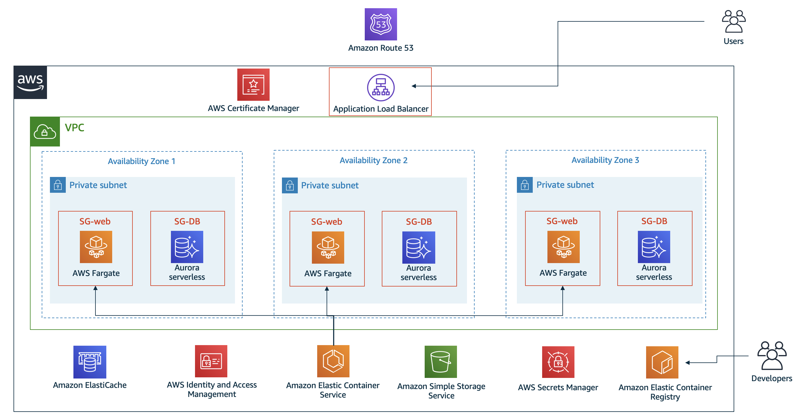

# Anycompany ECS demo

This repository contains the source code for a demo/PoC that has been created for the first demoday of the TechU program.

## Scenario

AnyCompany is an idea for an online clothing company, targeting a younger demographic, with the tagline: Your style, your attitude, your interview. The founders have been working on their business for a year. Now, they are ready to disrupt the professional business attire industry with their attention to detail and customer service. 

The technical team at AnyCompany consists of two developers who developed a web application locally on their laptops and on a server they built by using Ruby on Rails and MySQL. The founders think that the application is ready to launch, and having thought about using Amazon Web Services (AWS) to host applications, have come to your account team for help.

### Building a highly available web application

AnyCompany is looking for recommendations for deploying their application on AWS. Their questions are:
* What services should we use to deploy our application?
* As a new business, we can’t afford outages. Do you have any best practices for keeping our website available?
* If AnyCompany becomes an instant success, how do we manage the high volume of traffic to our website?
* How can we do all these tasks while keeping costs low? 

### Security, compliance, and the AWS environment

As they add new features and onboard additional developers, the AnyCompany team needs a scalable way to manage their AWS environments and ensure that security requirements are met. A few of their questions include:
* How many AWS accounts should we have? How do we manage them?
* How do we ensure that developers cannot accidentally push a change that will break an application’s compliance requirements?
* How do we enforce the principle of least privilege for developers? For example, deny access to production databases with customer personally identifiable information (PII).
* How do we implement policies to enforce encryption at rest and in transit? 

## Proposed architecture



## The demo

The demo contains almost all of the components mentioned in the diagram shown above. Elasticache and S3 where excluded because I haven't implemented the demo application itself to have use cases for those features (no need for persistent storage or state).

### The application

The application itself is a written in python (flask). It uses the AWS SDK (boto3) to interact with secrets manager to get database credentials. It uses environment variables to get the secretname and the region of the database secret.

### The CDK script

The infrastructure is written as code (IaC) in python using the CDK (Cloud Development Kit).

#### Getting started

To deploy this demo in your own AWS account, you need to [install the CDK](https://docs.aws.amazon.com/cdk/latest/guide/getting_started.html), change the variables in IaC/vars.py and run the following commands:
```bash
cd IaC/
pip3 install -r requirements.txt
cdk deploy
```
This will build and push the docker container and create a cloudformation template. The code itself is commented and pretty self-explanatory.